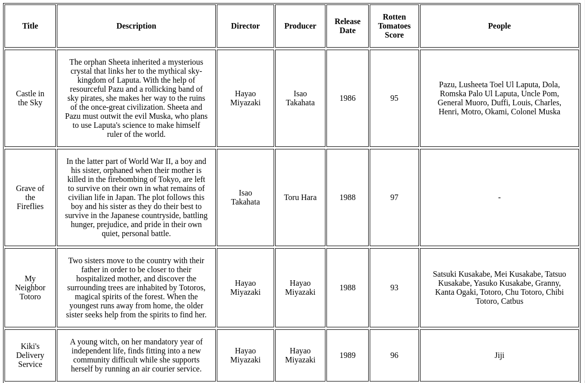

# Studio Ghibli Movies

This project displays the movies in the [Studio Ghibli API](https://ghibliapi.herokuapp.com/).
Main purpose is listing all of the movies in the `/movies` page which includes info about movie's title, description, producer, release date, Rotten Tomatoes score and people in the movie.




## Prerequisites
- docker
- docker-compose

## Build and Run
```bash
docker-compose up --build
```

Navigate to this using browser:
[http://localhost:8000/movies/](http://localhost:8000/movies/)


## Run Tests
```
docker-compose exec backend sh -c "cd ghibli; coverage run manage.py test"
```

## Versions

```bash
$ docker -v
Docker version 19.03.6, build 369ce74a3c
```
```bash
$ docker-compose version
docker-compose version 1.26.2, build unknown
docker-py version: 4.2.2
CPython version: 3.6.11
OpenSSL version: OpenSSL 1.1.1f  31 Mar 2020
```

## Notes

* Requests are cached for 60 seconds in redis.
* Tests can be extended by mocking Studio Ghibli API endpoints and patching the django view with the mock results.
